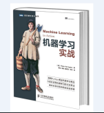
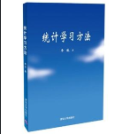
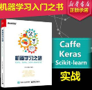

# sklearn 学习路线 | ApacheCN

## 1、开始学习吧

* [文档](http://sklearn.apachecn.org/cn/0.19.0/user_guide.html)
* [代码](https://github.com/apachecn/scikit-learn-doc-zh)
* [视频](https://space.bilibili.com/97678687/#!/index)
* [其他]()

## 2、推荐书籍

 

**书籍名称:** 机器学习实战  
**书籍简介:** 本书第一部分主要介绍机器学习基础，以及如何利用算法进行分类，并逐步介绍了多种经典的监督学习算法，如k近邻算法、朴素贝叶斯算法、Logistic回归算法、支持向量机、AdaBoost集成方法、基于树的回归算法和分类回归树（CART）算法等。第三部分则重点介绍无监督学习及其一些主要算法：k均值聚类算法、Apriori算法、FP-Growth算法。第四部分介绍了机器学习算法的一些附属工具。

**书籍名称:** 统计学习方法  
**书籍简介:** 统计学习是计算机及其应用领域的一门重要的学科。本书全面系统地介绍了统计学习的主要方法，特别是监督学习方法，包括感知机、k近邻法、朴素贝叶斯法、决策树、逻辑斯谛回归与最大熵模型、支持向量机、提升方法、em算法、隐马尔可夫模型和条件随机场等。除第1章概论和最后一章总结外，每章介绍一种方法。叙述从具体问题或实例入手，由浅入深，阐明思路，给出必要的数学推导，便于读者掌握统计学习方法的实质，学会运用。为满足读者进一步学习的需要，书中还介绍了一些相关研究，给出了少量习题，列出了主要参考文献。

**书籍名称:** sklearn书籍  
**书籍简介:** 巴拉巴拉小魔仙，抛瓦魔法

